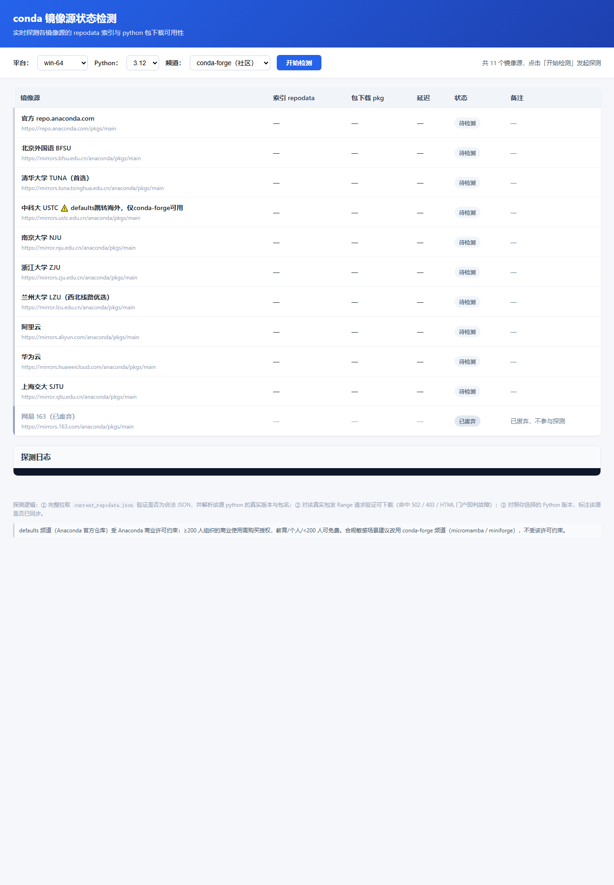
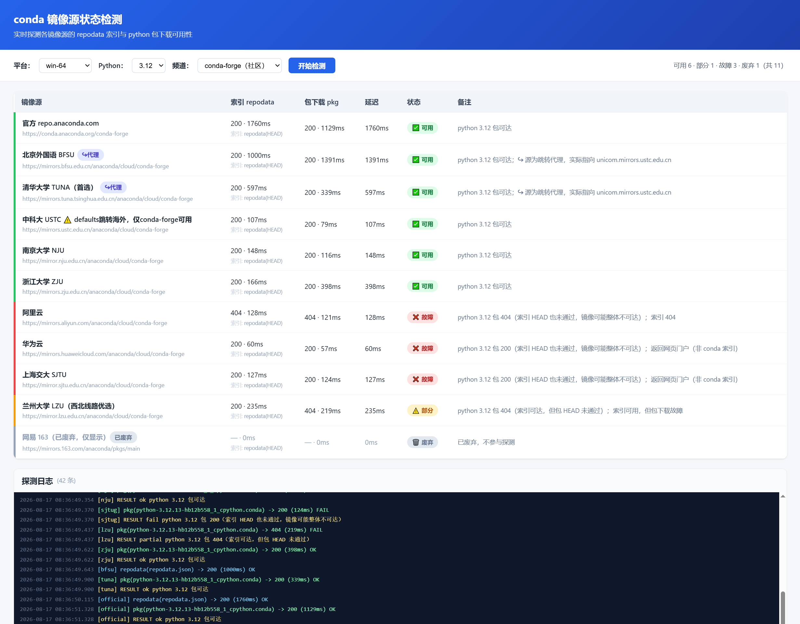

# 🪞 zn123-conda-mirror-checker

> 一眼看清你的 conda 镜像源到底哪个能用——索引拉得到吗？包真能下吗？

一个**零依赖**（仅用 Node 内置模块）的轻量 Web 小工具，实时探测并可视化展示各 conda 镜像源的可用性。




## ✨ 特性

- 🪶 **零依赖**：无需 `npm install`，下载即跑
- ⚡ **两步纯 HEAD 探测**：只取响应头、绝不下载 ~270MB 索引，秒级出结果，规避公网大文件限流/超时
- 🎛️ **多维切换**：平台（`win-64` / `linux-64` / `osx-64` / `osx-arm64`）、Python 版本（`2.7` ~ `3.14`）、频道（`defaults` / `conda-forge` / `both`）
- 🔀 **跳转代理检测**：识别跨域 302 跳转，避免把镜像代理误报成「源本身可用」
- 📜 **实时日志 + 落盘**：页面日志面板滚动展示，同时把完整探测写入 `logs/`，方便事后 grep 排查
- 🗑️ **废弃源仅显示**：标记为 `deprecated` 的源只展示、不参与探测

## 🚀 快速开始

### 环境要求

- Node.js ≥ 16
- 系统已安装 `curl`（Windows 上随 Git for Windows / 多数开发环境自带）

### 安装

```bash
git clone <your-github-repo-url> zn123_conda_test
cd zn123_conda_test
```

### 启动

```bash
node server.js
# 或双击 start.bat（Windows，前台运行，启动崩溃会暂停显示错误）
PORT=8080 node server.js   # 自定义端口
```

浏览器打开 **http://localhost:6688** 即可使用。

## 📖 了解更多

镜像源配置、探测算法、状态判定、API 等全部技术细节，见项目内 `.workbuddy/memory/MEMORY.md`。

## ⭐ 喜欢就点个 Star

如果这个工具帮你少踩了几个镜像坑，欢迎到 GitHub 点个 Star ☺️
你的支持是这个小工具继续维护下去的动力！

> 仓库地址：`<your-github-repo-url>`

## 📄 License

MIT
